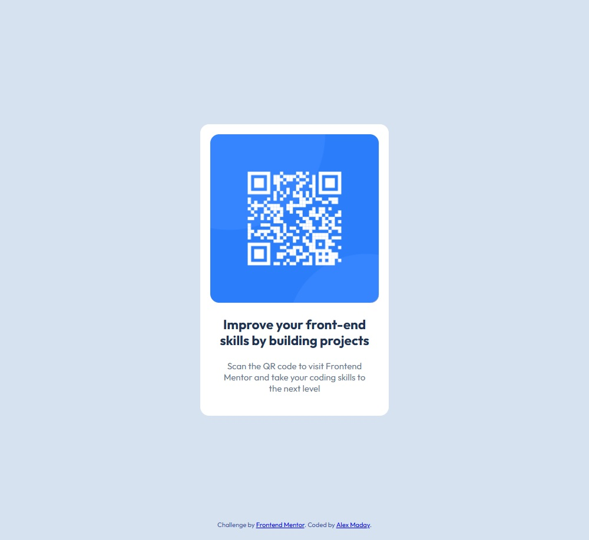

# Frontend Mentor - QR code component solution

This is a solution to the [QR code component challenge on Frontend Mentor](https://www.frontendmentor.io/challenges/qr-code-component-iux_sIO_H). Frontend Mentor challenges help you improve your coding skills by building realistic projects.

## Table of contents

- [Frontend Mentor - QR code component solution](#frontend-mentor---qr-code-component-solution)
  - [Table of contents](#table-of-contents)
  - [Overview](#overview)
    - [Screenshot](#screenshot)
    - [Links](#links)
  - [My process](#my-process)
    - [Built with](#built-with)
    - [Continued development](#continued-development)
    - [AI Collaboration](#ai-collaboration)
  - [Author](#author)
  - [Acknowledgments and Licensing](#acknowledgments-and-licensing)

## Overview

### Screenshot

### Links

- Solution URL: [Add solution URL here](https://your-solution-url.com)
- Live Site URL: [Add live site URL here](https://your-live-site-url.com)

## My process

### Built with

- Semantic HTML5 markup
- CSS custom properties
- Flexbox
- Mobile-first workflow

### Continued development

I look forward to working with more flexbox and grid layouts. I've recently been introduced to using custom properties which I use for colors and I anticipate more use cases as well. I consciously worked on using the right length units for the job. For instance, I used `rem`s for typography and `px` for more static attributes such as border radius.

### AI Collaboration

Describe how you used AI tools (if any) during this project. This helps demonstrate your ability to work effectively with AI assistants.

- Google Gemini chat with AGENTS.md
- I used Gemini to clarify concepts

## Author

- Website - [Add your name here](https://github.com/alexmaday)
- Frontend Mentor - [@yourusername](https://www.frontendmentor.io/profile/alexmaday)

## Acknowledgments and Licensing

- **Code License**: This project's custom source code is openly available under the [MIT License](./LICENSE).
- **Design & Assets**: All design mockups, images, and starter assets belong to [Frontend Mentor](https://www.frontendmentor.io). Usage falls under their official [Challenge License & Usage Policy](https://www.frontendmentor.io/license).
